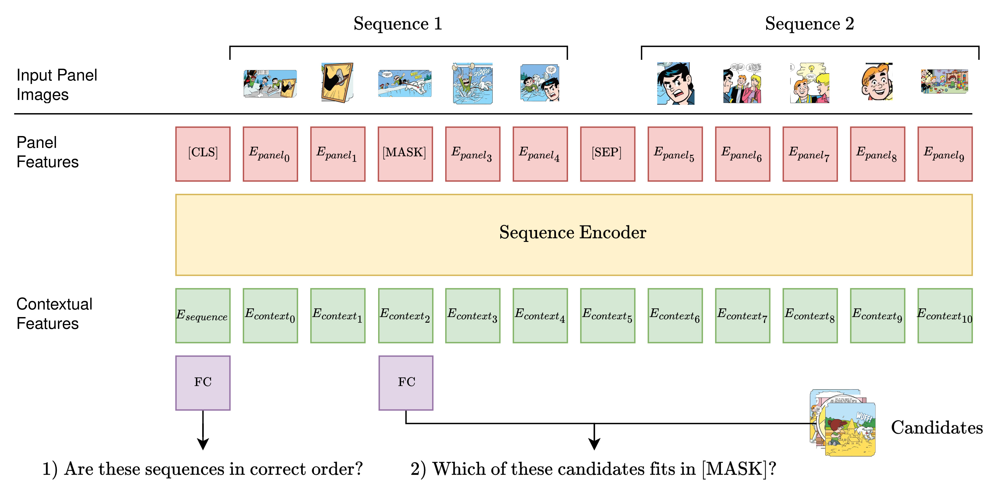

*📜 ASTERX Is part of [my thesis](https://samtitar.github.io/drawing_insights/thesis.pdf) on representation learning in comics. See also: [ELRIC](https://github.com/samtitar/ELRIC).*

# ASTERX

PyTorch implementation and pretrained models for ASTERX. For experimental details see **[Drawing Insights: Sequential Representation Learning in Comics]().**



## Data

ASTERX is trained on a mixture of the [COMICS dataset](https://obj.umiacs.umd.edu/comics/index.html) and the [TINTIN corpus](https://aclanthology.org/2022.lrec-1.736/). All data preprocessing steps required to train ASTERX are organised in the `scripts/data` directory. Each unprocessed dataset directory should be structured as follows:

```
annotations/        < Containing panels.csv and classification data
page_images/
    <comic>/
        page-1.jpg
        page-2.jpg
        ...
```

Run the following commands to perform all preprocessing steps including the extraction of panel images and character images based on annotations provided in `annotations/`

```bash
# Export panels, normalize names and split dataset into train, val and test
python scripts/data/export_panels.py --data-dir=path/to/dataset/root
python scripts/data/export_characters.py --data-dir=path/to/dataset/root
python scripts/data/normalize_names.py --data-dir=path/to/dataset/root
python scripts/data/split_dataset.py --data-dir=path/to/dataset/root

# Move to new directory
mkdir path/to/dataset/root/processed/panels
mv path/to/dataset/root/train_images path/to/dataset/root/processed/panels/train_images
mv path/to/dataset/root/val_images path/to/dataset/root/processed/panels/val_images
mv path/to/dataset/root/test_images path/to/dataset/root/processed/panels/test_images

# Turn directories into hdf5 files
python scripts/data/create_hdf5.py --data-path=path/to/dataset/root/processed/panels/train_images
python scripts/data/create_hdf5.py --data-path=path/to/dataset/root/processed/panels/val_images
python scripts/data/create_hdf5.py --data-path=path/to/dataset/root/processed/panels/test_images

# Create characters dataset
python scripts/data/export_characters.py --data-dir=path/to/dataset/root
python scripts/data/create_hdf5.py --data-path=path/to/dataset/root/processed/characters/train_images
python scripts/data/create_hdf5.py --data-path=path/to/dataset/root/processed/characters/val_images
python scripts/data/create_hdf5.py --data-path=path/to/dataset/root/processed/characters/test_images
python scripts/data/filter_characters.py --data-dir=path/to/dataset/root/processed/characters --indexing=path/to/dataset/root/annotations/characters_indexing.csv --min-frequency=25
```

## Backbone Feature Extraction
For efficieny, it is recommended to extract comic panel image features off-line before training ASTERX. Using `scripts/extract_features.py`, pre-trained ViT (I recomend to use DINO pretrained on the COMICS dataset and then the TINTIN corpus) features can be extracted from the image dataset created in the previous step.

## Training ASTERX
Using the extracted features from the previous step, ASTERX can be trained using the `scripts/training.py`. Exact details on (hyper)parameters can be found in my thesis, but notable settings are: `--sampling-key` determines which type of candidates are sampled, and `--sampling-strategy` determines the algorithm used to sample these candidates (I recommend using `mix`, as others can be very slow), `--no-cls-optimization` and `--no-tok-optimization` determine whether to optimize the sequential encoder to perform the ordering and the retrieval optimizations repsectively. `--negate-sampling` flips the `--sampling-key` (e.g. `--sampling-key=comic_level` becomes "All comics except for the comic this panel is from" when negated).

## Trained Model Checkpoints
Trained model checkpoints (including a ViT trained on the TINTIN corpus using DINO) are [publicly available](https://drive.google.com/drive/folders/1umCCyYNuD-yc_T7nmAbhQOhyDNxXWDNA?usp=sharing).
